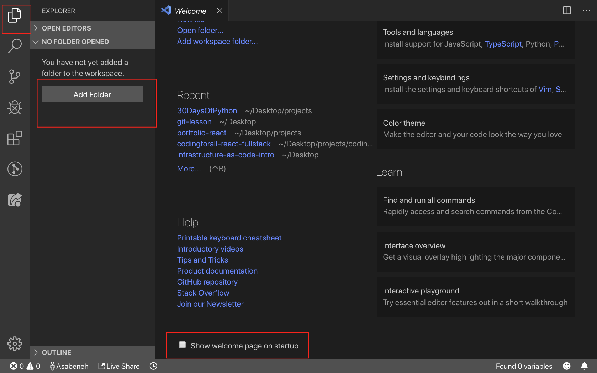
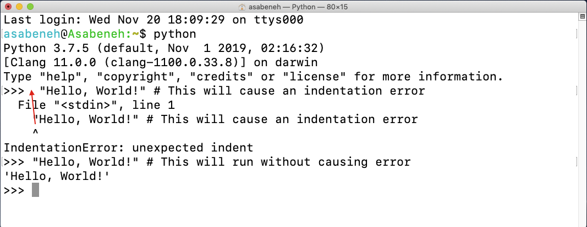

#   DAY 01

### Welcome

### Introduction 

    Python is a high-level programming language for general-purpose programming.

### Why Python?

    It is a programming language which is very close to human laguage and because of 
    that it is easy to learn an use. Python is used by various industries and companies
    (including Google). It has been used to develop web applications, desktop applications, 
    system adminstration, and machine learning libraries. 

    Python is highly embraced language in the data science and machine learning community. 
    I hope this is enough to convince you to start learning. Python is eating the world 
    and you are killing it before it eats you.

### Enviroent setup 

    -   Installing Python
        [Download](https://www.python.org/)
    
### Python Shell

    Python is an interpreted scripting language, so it does not need to be compiled.  It means it executes 
    the code line by line. 
    
    Python comes with a Python Shell (Python interative Shell). It is used a single python command and get the result

    Python shell waits for the Python code from the user. When you enter the code, it interprets the code and shows 
    the result in the next line. Open your terminal or commands prompt (cmd) and write:

    "   Python  "

####    Exemple code:

    https://github.com/Asabeneh/30-Days-Of-Python/blob/master/images/opening_python_shell.png

    https://github.com/Asabeneh/30-Days-Of-Python/blob/master/images/adding_on_python_shell.png

    https://github.com/Asabeneh/30-Days-Of-Python/blob/master/images/exit_from_shell.png

    https://github.com/Asabeneh/30-Days-Of-Python/blob/master/images/invalid_syntax_error.png

    https://github.com/Asabeneh/30-Days-Of-Python/blob/master/images/fixing_syntax_error.png

    https://github.com/Asabeneh/30-Days-Of-Python/blob/master/images/opening_python_shell.png

    https://github.com/Asabeneh/30-Days-Of-Python/blob/master/images/maths_on_python_shell.png

    https://github.com/Asabeneh/30-Days-Of-Python/blob/master/images/writing_string_on_shell.png

### Installing Visual Studio Code

    The Python interactive shell is good to try and test small codes but it will not be for a big 
    project. In real work enviroment, developers use different code editors to write codes. 
    In this cursos 30 days of Python programming challenge we will use Visual Studio Code.

    Visual Studio Code is a very popular open source text editor. I am a fan of VScode and I would 
    recommend to Download visual studio code, but if you are in favor of other editors, feel free
    to follow with what you have.

    [Visual Studio Code](https://code.visualstudio.com/)

    

    Create you folder project and open in vscode

    https://github.com/Asabeneh/30-Days-Of-Python/blob/master/images/opening_project.png

    Add New File

    https://github.com/Asabeneh/30-Days-Of-Python/blob/master/images/closing_opened_project.png

### Basic Python

### Python Syntax

    A python script can be written in Python interactive shell or in the code editor.
    A Puthon file has an extension .py.

### Python Indentation 

    An indentation is a white space in a text. Indentation in many languages is used code readability, 
    however Python uses indentation to create block of codes. In otherprogramming languages curly brackets
    are used to create blocks of codes instead of indentation. One of the common bugs when writing python
    code is wrong indentation.

    ](https://github.com/Asabeneh/30-Days-Of-Python/blob/master/images/indentation.png)

### Comments

    #   one line
    """
        Multiple lines
    """

###  Data Types

    Number
    String
    Booleans